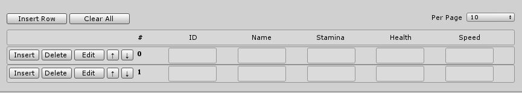

# tables
Unity plugin for simple data storage.

Store data in a column row structure.
Currently supported data type is strings.

This project requires API compatibility level: .NET 4.x
You should set this by going to Edit->Project Settings->Player

Project has a documentation folder with a manual and API documentation
generated with Doxygen.

